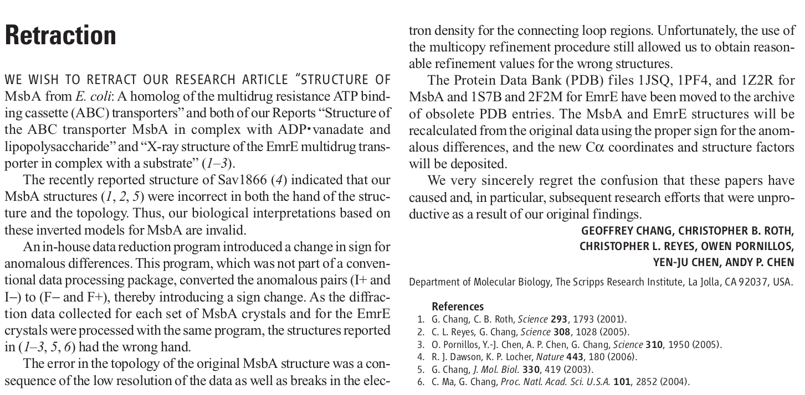

class: center middle

# Testing Scientific Software
### Christopher J. Markiewicz
#### Center for Reproducible Neuroscience
#### Stanford University

###### [effigies.github.io/testing-scientific-software](https://effigies.github.io/testing-scientific-software)

---
name: footer
layout: true

<div class="slide-slug">Testing Scientific Software - Nilearn Sprint - May 2020</div>

---

# Outline

1) A cautionary tale

2) Defining terms

3) A taste of pytest

4) Numerical testing

5) Generating test data

6) Useful testing tools

7) Neuroimaging concerns

---
layout: true
template: footer

---

# A Cautionary Tale



--

"An in-house [...] program introduced a change in sign ..."

--

"Unfortunately, the [...] procedure still allowed us to obtain reasonable refinement values for the wrong structures."

--

"We very sincerely regret [...] subsequent research efforts that were unproductive
as a result of our original findings."

---

# Why do we test software?

* Checking your work:

  * Do you reproduce known results?
  * Do novel inputs produce reasonable outputs?

--

* Clarity

  * The test is an alternative specification of the tested code

--

* Assurance

  * Make changes with the confidence that your tests will catch unintended consequences

---

# Types of tests

* Unit test - code that validates that some component works as expected

   * Example: Check that a function produces expected outputs for known inputs
   * Example: Verify that passing impermissible inputs raises a sensible error

--

* Integration test - code that validates that multiple components work together correctly

   * Similar to unit tests, but often a more complicated structure or series of
     actions is being tested

--

* Regression test - tests that verify that a behavior does not change

   * Example: Verify that a bug is not re-introduced after being fixed

--

* Smoke test - basic tests to identify major failure

   * Example: Verify the module imports before testing components

---

# Terminology: [xUnit](https://en.wikipedia.org/wiki/XUnit)

Smalltalk's SUnit library introduced a structure and vocabulary for unit testing.

Libraries that adopt this model are called "xUnit", and include Python's [unittest], [pytest] and [nose].

--

* Assertion - a function or expression that can pass or fail

    ```Python
    def assert(x):
        if not x: raise AssertionError
    ```

--

* Test case - a single test that passes/fails as a unit

  * Often contains a series of assertions

--

* Test fixture - setup and teardown around a test

   * Example: Create and `chdir` into a temporary directory; afterwards `chdir` back and delete the temporary directory

--

* Test suite - a set of test cases with a common fixture

---

# Testing in Python

Several test runners exist, including the Python standard library's [unittest], but
we will be using [pytest] framework.

pytest can be run on installed modules with the `--pyargs` flag. For example:

```Bash
$ pytest --pyargs nilearn
```

--

This will traverse the module and find:

* Within files called `test_*.py` or `*_test.py`, functions prefixed with `test`
* Subclasses of `unittest.TestCase`

--

The same can be done within a source directory:

```Bash
$ git clone git@github.com:nilearn/nilearn.git
$ cd nilearn
$ pytest nilearn/
```

---
layout: true
template: footer
name: NumericalTesting

# Numerical testing

.install-cmd[
```Python
import numpy as np
```
]

---

#### Element-wise comparisons

Comparison operators (`==`, `!=`, `<`, `>`, `<=`, `>=`) act element-wise
on Numpy arrays:

```Python
>>> x = np.arange(5)
>>> y = x[::-1]
>>> x == y
array([False, False,  True, False, False])
```

--

You can also generally compare an array to a scalar:

```Python
>>> x == 3
array([False, False, False,  True, False])
```

This is an example of [broadcasting], where smaller arrays can be expanded to
match larger arrays.

---

#### Aggregate comparisons

[`numpy.any()`][numpy.any] and [`numpy.all()`][numpy.all] return a single value
for entire arrays:

```Python
>>> x = np.ones(2)
>>> y = np.arange(2)
>>> np.all(x == y)
False
>>> np.any(x == y)
True
```

--

The `axis` argument permits more complicated checks:

```Python
>>> z = np.eye(3, dtype=bool)
>>> z
array([[1., 0., 0.],
       [0., 1., 0.],
       [0., 0., 1.]])
>>> z.any(axis=0)             # same as np.any(z, axis=0)
array([ True,  True,  True])
>>> z.any(axis=0).all()       # same as np.all(np.any(z, axis=0))
True
```

---

#### Aggregate comparisons

Numpy provides aggregate comparison functions.
[`array_equal()`][numpy.array_equal] checks shape and values, while
[`array_equiv()`][numpy.array_equiv] permits broadcasting.

```Python
>>> x = np.ones(2)
>>> y = np.arange(2)
>>> np.array_equal(x, 1)
False
>>> np.array_equiv(x, 1)
True
>>> np.all(x == 1)
True
```

--

Note that equality comparisons work for arrays of:

* Integers
* Booleans
* Strings
* Python objects (if comparable)

---

#### Floating point comparisons

Floating point arithmetic is inexact:

```Python
>>> 0.1 ** 2 == 0.01
False
```

--

Numerical operations should be assumed to accumulate error, and equality assertions
must come with tolerances.

```Python
>>> np.abs(0.1 ** 2 - 0.01) < 1e-10
True
```

--

Numpy provides the element-wise [`isclose()`][numpy.isclose] and aggregate [`allclose()`][numpy.allclose]:

```Python
def isclose(a, b, rtol=1e-05, atol=1e-08):
    return abs(a - b) < atol + rtol * abs(b)

def allclose(a, b, rtol=1e-05, atol=1e-08):
    return all(isclose(a, b, rtol, atol))
```

<!--
.footnote[
As of Python 3.5, the standard library has [`math.isclose`][math.isclose] for use with
scalars. See [pytest.approx] for a comparison of `numpy.isclose`, `math.isclose`, and
`pytest.approx`.
]
-->

---
template: footer

# Numerical testing example

Consider a function that calculates an HRF kernel:

```Python
def gamma_difference_hrf(tr, oversampling=50, time_length=32., onset=0.,
                         delay=6, undershoot=16., dispersion=1.,
                         u_dispersion=1., ratio=0.167):
    """ Compute an hrf as the difference of two gamma functions """
    dt = tr / oversampling
    time_stamps = np.linspace(0, time_length,
                              np.int(np.rint(float(time_length) / dt))) - onset
    hrf = (gamma.pdf(time_stamps, delay / dispersion, dt / dispersion) - ratio *
           gamma.pdf(time_stamps, undershoot / u_dispersion, dt / u_dispersion))
    return hrf / hrf.sum()
```

--

Testing specific values would be fragile, but we can assert constraints:

```Python
def test_gamma_difference_hrf():
    h = gamma_difference_hrf(2.0)
    assert np.isclose(h.sum(), 1)  # Convolution kernels should sum to 1
    assert len(h) == 800
    sign = h >= 0
    assert np.sum(sign[1:] ^ sign[:-1]) == 1  # Sign changes once
```

---

#### Non-finite numbers

Three types of non-finite floats: positive infinity, negative infinity, and
not-a-number (NaN).

```Python
>>> np.array([1, -1, 0]) / 0
array([inf,  -inf,  nan])
```

--

Infinities can be compared, but arithmetic breaks down. `NaN`s can't be compared at all.

```Python
>>> -np.inf < 10.**300 < np.inf
True
>>> np.inf == np.inf and -np.inf == -np.inf
True
>>> np.inf / 20 - 1 == np.inf
True
>>> np.inf / np.inf
nan
>>> np.nan == np.nan
False
```

---

#### Non-finite numbers

Usual equality checks fail:

```Python
>>> x = np.array([-1, 0, 1])
>>> np.allclose(x / x, x / x)
False
```

--

Identifying NaNs requires [`isnan()`][numpy.isnan]:

```Python
>>> x / x == np.nan
array([False, False, False])
>>> np.isnan(x / x)
array([False,  True, False])
```

--

[`allclose()`][numpy.allclose] can also accommodate NaNs.

```Python
>>> np.allclose(x / x, x / x, equal_nan=True)
True
```

---

## Summary

* Numpy provides flexible semantics for comparing arrays element-wise or
  in aggregate

--

* Floating point arithmetic can violate algebraic expectations

   * Non-finite values are extreme cases

--

* Check equality using [`allclose`][numpy.allclose], and pay attention to
  your tolerances and your NaNs

--

* Results of numeric algorithms may be better tested by constraints than
  closeness checks

---
layout: true
template: footer

# Generating random data

---

A test may require input data that is plausible, or at least non-trivial.

Random values avoid dependence on hand-selected inputs, helping to reduce fragility.
As of Numpy 1.17, the preferred API is [`numpy.random.default_rng`][numpy.random.default_rng].

```Python
>>> from numpy.random import default_rng
>>> rng = default_rng(seed=20200519)
>>> rng.random()
0.34536245159439116
>>> rng.random(5)
array([0.65246666, 0.30129309, 0.96712464, 0.59715458, 0.79585103])
```

--

Note that seeding is a double-edged sword. It ensures your tests will pass/fail consistently,
but you only ever observe the same portion of the input space.

```Python
>>> default_rng(20200519).random()
0.34536245159439116
```

---
 
Example: validate that [`numpy.arctan`][numpy.arctan] returns a value in \\((-\pi, \pi)\\).

```Python
def test_arctan_range():
    rng = np.random.default_rng()
    info = np.finfo('float32')
    test_data = rng.uniform(info.min, info.max)
    assert np.abs(np.arctan(test_data)) < np.pi
```

.footnote[
Uses: `numpy.finfo` to access information about floating point types;
`rng.uniform` for a parameterizable distribution.
]

--

A single value won't give you a high probability of failure.

```Python
def test_arctan_range():
    rng = np.random.default_rng()
    info = np.finfo('float32')
    test_data = rng.uniform(info.min, info.max, size=100000)
    assert np.all(np.abs(np.arctan(test_data)) < np.pi)
```

---
layout: true
template: footer

# Generating structured data

---

We have seen how to generate scalars and arrays of uniform random data.

More structure can be provided via:

#### 1. Shapes, such as matrices, volumes, or higher-dimensional arrays.
```Python
>>> fake_slice = rng.random((128, 128))
>>> fake_volume = rng.random((256, 256, 150))
>>> fake_time_series = rng.random((64, 64, 40, 200))
```

--
#### 2. Different statistics
* [Uniform][uniform]
* [Normal][normal]
* [...][distribution list]

Random walk:

```Python
>>> fake_motion_params = np.cumsum(rng.normal(size=(200, 6)), axis=0)
```

---

#### 3. Non-random arrays
* [`numpy.full`][numpy.full] - generate constant array of any shape
* [`scipy.ndimage`][scipy.ndimage] - filter or modify existing arrays
* [`skimage.morphology`][skimage.morphology] - generate shapes of `1` on background `0`
<figure style="width: 40%">

<figcaption>From <a href="https://scikit-image.org/docs/0.17.x/auto_examples/numpy_operations/plot_structuring_elements.html">Generate
structuring elements &mdash; skimage v0.17.2 docs</a></figcaption>
</figure>

---

.install-cmd[
```python
import nibabel as nb
import skimage as ski
```
]

#### 4. Spatial images

[NiBabel][nibabel] provides a `SpatialImage` API that pairs a
data array with an [affine matrix][affines] describing the orientation
of the data.

Quasi-realistic image with a 50mm sphere of ones in the center,
although the origin is in the corner of the image.

```Python
>>> dataobj = np.zeros((128, 128, 128), dtype=np.uint8)
>>> dataobj[14:115, 14:115, 14:115] = ski.morphology.ball(50)
>>> fake_brainmask = nb.spatialimages.SpatialImage(dataobj, np.eye(4))
```


If your algorithm assumes format-specific header fields, concrete image types can be used:

```Python
>>> fake_brainmask = nb.Nifti1Image(dataobj, np.eye(4))
```

---
template: footer

# Generating data

## Summary

* Test data can be generated with varying amounts of structure

   * Array shape
   * Distribution of values
   * Embed in Python objects

* Add the minimum amount of structure needed to test the target functionality

---
template: footer

# Example (regression) test

```Python
def test_clean_finite_no_inplace_mod():
    """
    Test for verifying that the passed in signal array is not modified.
    For PR #2125 . This test is failing on master, passing in this PR.
    """
    # n_features  Must be higher than 500
    x_orig, _, _ = generate_signals(n_features=501, length=2)
    x_orig_inital_copy = x_orig.copy()

    x_orig_with_nans = x_orig.copy()
    x_orig_with_nans[0, 0] = np.nan
    x_orig_with_nans_initial_copy = x_orig_with_nans.copy()

    cleaned_x_orig = clean(x_orig)
    assert np.array_equal(x_orig, x_orig_inital_copy)

    cleaned_x_orig_with_nans = clean(x_orig_with_nans, ensure_finite=True)
    assert np.isnan(x_orig_with_nans[0, 0])
    assert np.allclose(x_orig_with_nans_initial_copy,
                       x_orig_with_nans, equal_nan=True)
```

https://github.com/nilearn/nilearn/blob/f1b09b3/nilearn/tests/test_signal.py#L472-L494

---
layout: true
template: footer

# pytest/unittest constructs

.install-cmd[
```Python
import unittest
import pytest
```
]

---

This section describes some useful constructs in [unittest] and [pytest].

## Validating exceptions

It is useful to validate that code fails in expected ways.

[`pytest.raises`][pytest.raises] allows you to check individual statements
that are intended to raise an error:

```Python
with pytest.raises(ZeroDivisionError):
    1 / 0
```

At times, it's more convenient to mark an entire test as an "expected failure":

```Python
@pytest.mark.xfail(raises=ZeroDivisionError)
def test_zerodivision():
    1 / 0
```

[`pytest.warns`][pytest.warns] does similar work for warnings.

---

## Skipping tests

A test can be marked for skipping in several ways.

```Python
def test_a():
    if some_condition:
        raise unittest.SkipTest("I can't run this test")

@unittest.skipIf(sys.version_info < (3, 5))
def test_b():
    """ This test checks a feature inaccessible to Python 2.7 and 3.4 users """
```

If you need to test with optional dependencies, `nibabel` has `optional_package`:

```Python
h5py, have_h5py, _ = nibabel.optional_package("h5py")
needs_h5py = unittest.skipUnless(have_h5py, reason="Test requires h5py")

@needs_h5py
def test_b():
    ...
```

---

## Pytest fixtures

Pytest fixtures are invoked by adding arguments to tests. For example, `tmp_path`
creates a temporary directory and provides it as a `pathlib.Path`.

```Python
def test_round_trip(tmp_path):
    img = nb.Nifti1Image(np.zeros((5, 5, 5)), np.eye(4))
    img.to_filename(tmp_path / "test.nii")
    img2 = nb.load(tmp_path / "test.nii")
    assert np.allclose(img.get_fdata(), img2.get_fdata())
    assert np.allclose(img.affine, img2.affine)
```

If this wasn't provided, it could be written easily:

```Python
@pytest.fixture
def tmp_path():
    import pathlib, tempfile
    with tempfile.TemporaryDirectory() as tmpdir:
    	yield pathlib.Path(tmpdir)
```

---

## Parameterization

Whenever you see:

```Python
def test_me():
    for a, b in [('arg1', 'arg2'), ('arg3', 'arg4')]:
        f(a, b)
```

This can be replaced with:

```Python
@pytest.mark.parametrize("a, b", [('arg1', 'arg2'), ('arg3', 'arg4')])
def test_me(a, b)
    f(a, b)
```

The primary advantage is that each set of parameters becomes an independent
test, so you can see all failing cases at once.

---

## Mocking

> [`unittest.mock`][unittest.mock] [...] allows you to replace parts of your system
> under test with mock objects and make asssertions about how they have been used.

This could be a lecture in itself. Two quick examples:

```Python
from unittest.mock import patch

@patch.dict(os.environ, {'FREESURFER_HOME': '/opt/freesurfer'})
def test_fs():
    subjects = os.getenv('FREESURFER_HOME')
    ...

def test_fetcher():
    with patch.object(requests, "get") as mock:
        mock.return_value = plausible_response
        my_fetcher()
    assert mock.called
```

---

## Summary and commentary

* Exceptions and warnings are part of your API and can be tested

--

* Skipping tests is a useful tool, but use it sparingly

--

* Fixtures a) are extremely handy; b) take some getting used to.

--

* Mocks are mind-bending, but are good for avoiding unwanted side effects
  or testing rare cases.

--

* About 10 years ago, nose was quite popular. Now pytest is on top. Using
  vanilla [unittest] constructs where you can might save you some effort when
  pytest is end-of-life.

---
layout: true
template: footer

---

# Neuroimaging concerns

Some brief notes on things that warrant

--

* Orientation sensitivity. Does your method:

   * Assume an orientation of an input image?
      * (Maybe) appropriate for private methods/functions
   * Validate the orientation of an input image?
      * Appropriate for public APIs
   * Account for the orientation of an input image?
      * Most user-friendly

--

* Image class. Do you assume your input is `Nifti1Image`, without ever checking?
  Try testing with `MGHImage` or `AnalyzeImage`.

--
* NIfTI quirks:

   * Two affines (qform/sform) - mostly an interoperability problem
   * `xyzt_units` - do you assume voxel sizes are in mm, TR in seconds?
   * Header extensions - difficult to respect, so often best to remove

---

# Conclusion

* Testing scientific software is essential for good science.

--

* At the same time, bugs happen. Regression tests help us move forward.

--

* The Python ecosystem has good testing infrastructure
   * Pytest and unittest provide a good base.
   * numpy provides the tools for numerical testing.
   * Generating test data is relatively simple in an expressive language.

---

# Credits

The following presentations and blog posts were useful while constructing
this presentation.

Almost all of them are heavier on the justifying arguments, so if you find
yourself insufficiently motivated, please read further.

* [Automated testing and research software](http://ivory.idyll.org/blog/automated-testing-and-research-software.html) by
  C. Titus Brown
* [Software Carpentry v4: Testing](https://v4.software-carpentry.org/test/index.html) by the [Software Carpentry v4 contributors](https://github.com/swcarpentry/v4/graphs/contributors)
* [Testing academic code or "How to avoid having to retract your paper](https://www.slideshare.net/chrisfilo1/software-testing-for-scientists) by
  Chris Gorgolewski
* [Writing unit and regression tests](http://nipy.org/workshops/2017-03-boston/lectures/lesson-testing/#1) by Satra Ghosh
* [Pythontesting.net](https://pythontesting.net/start-here/) by Brian Okken

---
class: center middle

# Questions?

##### [effigies.github.io/testing-scientific-software](https://effigies.github.io/testing-scientific-software)


---
layout: true
class: extra

---
count: false

# Additional concepts

* Documentation tests ([doctests](https://en.wikipedia.org/wiki/Doctest)) are tests of the
  code within the method's docstring (initial comment)

* [Code coverage](https://en.wikipedia.org/wiki/Code_coverage) measures percent of lines that
  are exercised by tests. Low coverage is typically a bad sign, but coverage does not equate to
  a good test.

* [Minimal reproducible example](https://stackoverflow.com/help/minimal-reproducible-example) is
  a reproduction of an error that uses as little code as possible while clearly demonstrating the
  problem. This is good to establish when reporting a bug, and can often become the test.

* [Property based testing](https://en.wikipedia.org/wiki/QuickCheck) writes tests as constraints,
  and generates test cases. The Python tool is [Hypothesis](https://hypothesis.works/)

* [Fuzzing](https://en.wikipedia.org/wiki/Fuzzing) provides structured but randomized data to find
  edge cases in logic.


[unittest]: https://docs.python.org/3/library/unittest.html
[pytest]: https://docs.pytest.org/
[nose]: https://nose.readthedocs.io/
[unittest.mock]: https://docs.python.org/3/library/unittest.mock.html

[nibabel]: https://nipy.org/nibabel
[affines]: https://nipy.org/nibabel/coordinate_systems.html

[broadcasting]: https://numpy.org/doc/stable/user/basics.broadcasting.html
[numpy.any]: https://numpy.org/doc/stable/reference/generated/numpy.any.html
[numpy.all]: https://numpy.org/doc/stable/reference/generated/numpy.all.html
[numpy.array_equal]: https://numpy.org/doc/stable/reference/generated/numpy.array_equal.html
[numpy.array_equiv]: https://numpy.org/doc/stable/reference/generated/numpy.array_equiv.html

[numpy.allclose]: https://numpy.org/doc/stable/reference/generated/numpy.allclose.html
[numpy.isclose]: https://numpy.org/doc/stable/reference/generated/numpy.isclose.html
[math.isclose]: https://docs.python.org/3/library/math.html#math.isclose
[pytest.approx]: https://docs.pytest.org/en/latest/reference.html#pytest-approx
[numpy.isnan]: https://numpy.org/doc/stable/reference/generated/numpy.isnan.html

[numpy.random.default_rng]: https://numpy.org/doc/stable/reference/random/generator.html#numpy.random.default_rng
[numpy.arctan]: https://numpy.org/doc/stable/reference/generated/numpy.arctan.html
[numpy.full]: https://numpy.org/doc/stable/reference/generated/numpy.full.html

[distribution list]: https://numpy.org/doc/stable/reference/random/generator.html#distributions "Full list of distributions"
[uniform]: https://numpy.org/doc/stable/reference/random/generated/numpy.random.Generator.uniform.html
[normal]: https://numpy.org/doc/stable/reference/random/generated/numpy.random.Generator.normal.html
[poisson]: https://numpy.org/doc/stable/reference/random/generated/numpy.random.Generator.poisson.html
[exponential]: https://numpy.org/doc/stable/reference/random/generated/numpy.random.Generator.exponential.html

[skimage.morphology]: https://scikit-image.org/docs/0.17.x/api/skimage.morphology.html
[scipy.ndimage]: https://docs.scipy.org/doc/scipy/reference/ndimage.html

[pytest.raises]: https://docs.pytest.org/en/latest/assert.html#assertions-about-expected-exceptions
[pytest.warns]: https://docs.pytest.org/en/latest/warnings.html#warns
